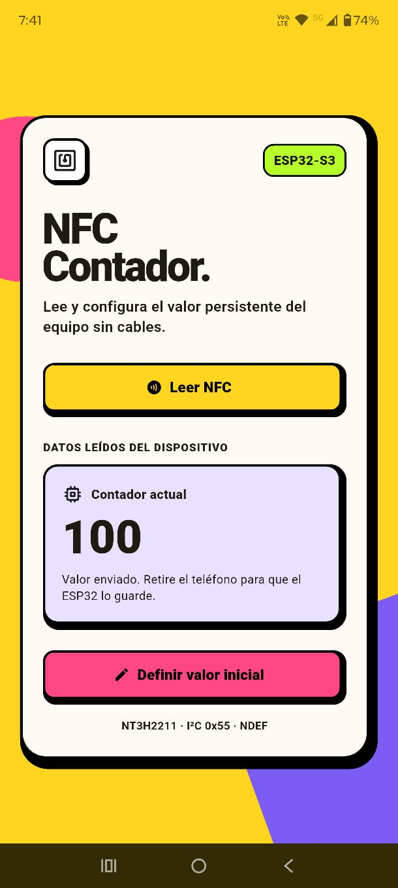
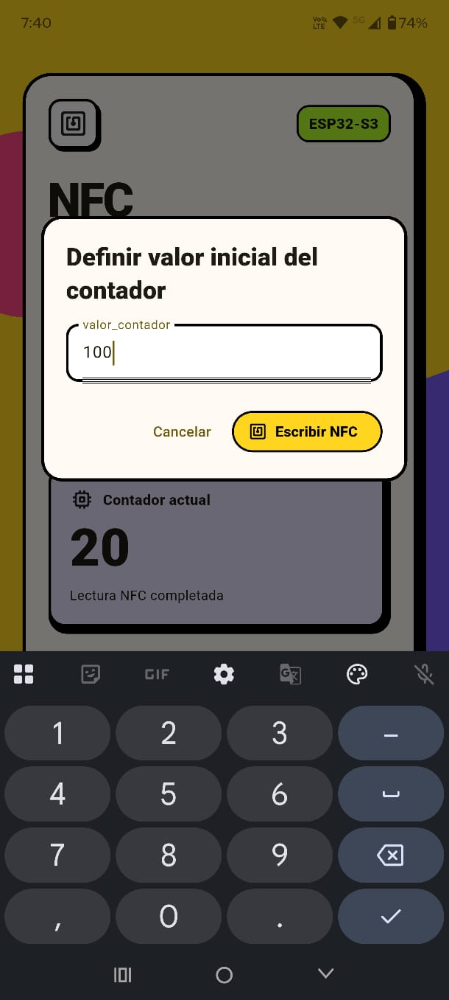

# Contador NFC bidireccional con ESP32-S3 y NT3H2211

Prueba de concepto funcional para leer y modificar desde un teléfono Android un
contador persistente almacenado en la NVS de un ESP32-S3. El NT3H2211 funciona
como puente entre dos mundos: por radio se presenta como una etiqueta NFC Forum
Type 2 y por cable expone la misma memoria al ESP32-S3 mediante I²C.

El proyecto permite:

- publicar en NFC el valor almacenado en NVS;
- leerlo desde una aplicación Android;
- escribir un valor nuevo desde el teléfono;
- detectar cuándo el teléfono abandona el campo RF;
- validar el NDEF recibido y guardarlo en NVS;
- conservar el contador después de reiniciar el ESP32-S3.

## Resultado

<p align="center">
  
  &nbsp;&nbsp;
  
</p>

La prueba física confirmó:

- NT3H2211 detectado correctamente en la dirección I²C `0x55`;
- lectura del valor inicial `contador=20` desde Android;
- escritura de `contador=100` desde Android;
- actualización de NVS al retirar el teléfono;
- republicación automática del NDEF con el nuevo valor;
- posteriores lecturas de `contador=100` desde la aplicación.

## Estructura del repositorio

| Ruta | Contenido |
|---|---|
| [`NFC_S3_NVS/`](NFC_S3_NVS/) | Firmware ESP-IDF 5.5.4 para ESP32-S3. |
| [`app_nfc_s3/`](app_nfc_s3/) | Aplicación Flutter para Android. |
| [`docs/images/`](docs/images/) | Capturas utilizadas en esta documentación. |
| [`NXP_Semiconductors-NT3H2211W0FHKH-datasheet.pdf`](NXP_Semiconductors-NT3H2211W0FHKH-datasheet.pdf) | Datasheet local del NT3H2111/NT3H2211, revisión 3.6. |

## Arquitectura

```text
┌────────────────────┐     NFC-A / 13,56 MHz     ┌────────────────────┐
│ Aplicación Android │ <────────────────────────> │     NT3H2211       │
│ Flutter + NDEF     │    NFC Forum Type 2 Tag   │ EEPROM compartida  │
└────────────────────┘                            └─────────┬──────────┘
                                                          │
                                      I²C 100 kHz, 0x55   │   FD
                                                          │   activo bajo
                                               ┌──────────▼──────────┐
                                               │      ESP32-S3       │
                                               │ ESP-IDF + FreeRTOS  │
                                               └──────────┬──────────┘
                                                          │
                                               API NVS    │
                                               ┌──────────▼──────────┐
                                               │ contador_nvs       │
                                               │ contador: int32_t  │
                                               └─────────────────────┘
```

El teléfono y el ESP32 no se comunican directamente. Ambos acceden a la memoria
del NT3H2211 y el propio integrado arbitra cuál interfaz puede usarla.

## Hardware y conexiones

| Señal | ESP32-S3 | NT3H2211 | Observación |
|---|---:|---|---|
| SDA | GPIO8 | SDA | Pull-up externa recomendada de 4,7 kΩ a 3,3 V. |
| SCL | GPIO9 | SCL | Pull-up externa recomendada de 4,7 kΩ a 3,3 V. |
| Field Detect | GPIO18 | FD | Salida open-drain; usar pull-up externa mayor de 2 kΩ. |
| Alimentación | 3,3 V | VCC | No aplicar 5 V al ESP32-S3. |
| Tierra | GND | VSS | La tierra debe ser común. |

El firmware habilita las pull-ups internas del controlador I²C y de GPIO18,
pero para un montaje estable deben conservarse las resistencias externas. Se
asume un módulo NT3H2211 con antena y red de adaptación ya resueltas; si se usa
el integrado suelto, la antena de 13,56 MHz requiere diseño y sintonización RF.

## Protocolos utilizados

| Capa | Protocolo/formato | Uso en el proyecto |
|---|---|---|
| Radio | NFC-A / ISO/IEC 14443-A a 13,56 MHz | Enlace entre Android y NT3H2211. |
| Etiqueta | NFC Forum Type 2 Tag | Modelo de páginas y acceso compatible con Android. |
| Datos de aplicación | NDEF Text Record UTF-8 | Transporta el texto `contador=<valor>`. |
| Enlace cableado | I²C, maestro ESP32, esclavo de 7 bits `0x55` | Acceso del ESP32 a EEPROM y Session Registers. |
| Evento físico | Pin FD activo en bajo | Informa entrada y salida del campo RF. |
| Persistencia | NVS de ESP-IDF | Guarda el contador como `int32_t` en la flash. |

### NFC y NDEF

La aplicación abre una sesión ISO 14443 y utiliza las operaciones NDEF de
Android. No usa comandos NFC-A privados ni requiere conocer el mapa de memoria
del NT3H2211.

El contrato de datos del PoC es un único NDEF Text Record:

```text
contador=100
```

El idioma del Text Record es `es`, el texto se codifica en UTF-8 y el firmware
acepta un entero con signo de 32 bits. La interfaz actual de la app limita la
entrada del usuario al rango `0` a `2147483647`.

La representación escrita por el firmware comienza así:

| Campo | Valor | Significado |
|---|---:|---|
| TLV Tag | `0x03` | El contenido es un mensaje NDEF. |
| TLV Length | variable | Longitud del registro NDEF. |
| Record Header | `0xD1` | Primer y último registro, formato corto, TNF well-known. |
| Type Length | `0x01` | Un byte de tipo. |
| Payload Length | variable | Idioma más texto. |
| Type | `0x54` (`T`) | NFC Forum Text Record. |
| Status | `0x02` | UTF-8 y código de idioma de dos bytes. |
| Language | `es` | Idioma del texto. |
| Text | `contador=<n>` | Dato intercambiado. |
| Terminator TLV | `0xFE` | Fin de los TLV. |

El firmware reserva 32 bytes, equivalentes a dos bloques I²C, para este mensaje.
El tamaño es suficiente para el contrato actual, pero no para mensajes NDEF
arbitrarios.

### I²C

El ESP32-S3 es el maestro del bus y el NT3H2211 es un esclavo con dirección de
7 bits `0x55`. El bus funciona a 100 kHz usando el driver maestro moderno de
ESP-IDF (`driver/i2c_master.h`).

Desde I²C, la memoria del NT3H2211 se organiza en bloques de 16 bytes:

- una lectura envía primero la dirección del bloque, genera `STOP`, espera al
  menos 50 µs y recibe 16 bytes;
- una escritura envía la dirección del bloque seguida por sus 16 bytes;
- después de escribir EEPROM, el firmware espera al menos 5 ms;
- todas las operaciones se serializan con un mutex de FreeRTOS;
- el escaneo y el sondeo usan direcciones de 7 bits, por eso el log muestra
  `0x55` y no los bytes de bus `0xAA/0xAB`.

En el bus físico, `0x55` produce `0xAA` para escritura y `0xAB` para lectura al
añadir el bit R/W.

### Field Detect

FD es una salida open-drain del NT3H2211. El firmware modifica los bits
`FD_ON[3:2]` y `FD_OFF[5:4]` del `NC_REG` de sesión:

```text
Session block: 0xFE
NC_REG offset: 0x00
Máscara:        0x3C
Valor:          0x00

FD_ON  = 00 -> FD baja cuando aparece el campo RF
FD_OFF = 00 -> FD se libera cuando desaparece el campo RF
```

GPIO18 se configura con interrupción en ambos flancos. La ISR sólo notifica una
tarea; no realiza I²C, análisis NDEF ni escrituras de flash. La tarea aplica un
debounce de 15 ms y procesa el NDEF al detectar el flanco de salida del campo.

### NVS

El firmware abre el namespace `contador_nvs` y usa la clave `contador` como
`int32_t`:

- si la clave no existe, crea el valor inicial `20` y ejecuta `nvs_commit()`;
- si ya existe, conserva el valor previo después de un reinicio;
- sólo escribe y confirma NVS cuando el valor NFC es diferente;
- un mutex protege las lecturas y escrituras concurrentes;
- una tarea de monitor imprime el valor actual cada 5 segundos sin modificarlo.

## Configuración del NT3H2211

La configuración se realiza durante el arranque y está implementada en
[`nt3h2211.c`](NFC_S3_NVS/main/app/nt3h2211.c).

### 1. Alta del dispositivo y sondeo

El ESP32 inicializa I²C0 con SDA en GPIO8, SCL en GPIO9 y 100 kHz. Luego sondea
`0x55`; si el NT3H2211 no responde, `app_main()` se detiene mediante
`ESP_ERROR_CHECK` para no continuar con un hardware ausente.

### 2. Capability Container

Un NT3H2211 nuevo entrega el Capability Container en cero. Sin un CC válido,
Android no puede tratar la memoria como una etiqueta NFC Forum Type 2 con NDEF.
El firmware lee el bloque I²C `0x00` y comprueba sus bytes 12 a 15:

```text
E1 10 6D 00
```

| Byte | Explicación |
|---:|---|
| `E1` | Magic Number de NFC Forum Type 2 Tag. |
| `10` | Versión 1.0 del mapeo. |
| `6D` | Área de datos declarada: `0x6D × 8 = 872` bytes. |
| `00` | Lectura y escritura NFC sin restricciones. |

El valor `0x6D` mantiene el final del área Type 2 en una granularidad de bloqueo
recomendada por NXP. El PoC sólo utiliza los primeros 32 bytes del área, pero el
CC describe correctamente una región NDEF mayor para las herramientas NFC.

Hay una precaución crítica: en la vista I²C, el byte 0 del bloque `0x00` también
programa la dirección del esclavo. Al leerlo, el chip devuelve `0x04` porque ese
byte comparte la vista con `UID0`; si se reescribiera sin corregirlo, la dirección
podría cambiar accidentalmente. Antes de escribir el CC, el firmware coloca:

```c
block0[0] = 0x55 << 1; // 0xAA
```

Los demás bytes del bloque se preservan, incluidos los lock bytes, y después se
vuelve a sondear `0x55` para confirmar que el dispositivo continúa accesible.

### 3. Área NDEF

La memoria de usuario comienza en el bloque I²C `0x01`, equivalente a la página
NFC `0x04`. El firmware escribe o lee dos bloques completos:

```text
Bloque I²C 0x01: primeros 16 bytes del TLV/NDEF
Bloque I²C 0x02: siguientes 16 bytes y relleno con cero
```

Antes de tocar EEPROM se consulta `NS_REG` y se espera hasta que estén en cero:

```text
RF_LOCKED      bit 5 -> la interfaz NFC posee la memoria
EEPROM_WR_BUSY bit 1 -> hay un ciclo interno de escritura en curso
```

El timeout de espera es 500 ms. Los Session Registers siguen disponibles aun
cuando la memoria principal está bloqueada por la interfaz opuesta.

### 4. Arbitraje NFC/I²C

El NT3H2211 aplica arbitraje **first-come, first-served**:

- si `RF_LOCKED=1`, el ESP32 no intenta acceder a EEPROM;
- si `I2C_LOCKED=1`, el teléfono no puede leer o escribir la memoria principal;
- al desaparecer el campo RF, el chip libera la interfaz NFC;
- entonces GPIO18 sube, la tarea lee el NDEF y actualiza NVS;
- después de un cambio real, el ESP32 vuelve a publicar el valor confirmado.

Este orden evita que Android y el ESP32 escriban simultáneamente la memoria.

### 5. Por qué no se usa SRAM pass-through

El NT3H2211 dispone de una SRAM volátil de 64 bytes y un modo pass-through, pero
no se activa en este PoC. Para usarlo sería necesario implementar:

- comandos NFC-A crudos sobre las páginas `F0h` a `FFh`;
- dirección de transferencia mediante `TRANSFER_DIR`;
- handshake con `SRAM_I2C_READY` y `SRAM_RF_READY`;
- fragmentación, terminadores y confirmaciones propios;
- manejo de la pérdida del contenido cuando desaparece VCC.

Para un único entero y cambios poco frecuentes, NDEF en EEPROM es más simple,
interoperable con Android y suficiente para validar la comunicación en ambos
sentidos. Pass-through sería apropiado para telemetría frecuente o mensajes con
mayor tasa de actualización.

## Flujo completo

### Arranque

1. Inicializar la partición NVS.
2. Crear `contador=20` únicamente en el primer arranque.
3. Inicializar I²C y verificar el NT3H2211 en `0x55`.
4. Dar de alta el dispositivo a 100 kHz.
5. Verificar o inicializar el Capability Container.
6. Configurar FD como detector de presencia de campo RF.
7. Leer el contador desde NVS.
8. Publicar `contador=<valor>` como NDEF.
9. Iniciar la tarea de eventos NFC y el monitor periódico.

### Lectura desde Android

```text
NVS
  -> ESP32-S3 crea NDEF
  -> EEPROM del NT3H2211
  -> NFC Forum Type 2 Tag
  -> Android lee Text Record
  -> la app valida "contador=<entero>"
  -> muestra el valor
```

La app mantiene activo el modo lector mientras el teléfono permanece sobre la
antena. Sólo cierra la sesión cuando detecta que la etiqueta fue retirada. Esto
evita que Android vuelva a descubrir inmediatamente el mismo NDEF y abra su
pantalla del sistema **«Nueva etiqueta recolectada»**.

En cuanto el NDEF queda leído y validado, antes de retirar el teléfono, la app
muestra el valor, cambia la tarjeta a verde, presenta el aviso **LECTURA
COMPLETADA - RETIRE EL TELÉFONO** y genera sonido más vibración adicional.

### Escritura desde Android

```text
Usuario introduce un valor
  -> app crea Text Record NDEF
  -> Android escribe EEPROM por NFC
  -> usuario retira el teléfono
  -> FD genera el flanco de fin de campo
  -> tarea del ESP32 lee y valida el NDEF
  -> compara contra NVS
  -> guarda sólo si cambió
  -> republica el NDEF confirmado
```

La confirmación de Android significa que la escritura NDEF terminó. La
persistencia definitiva ocurre después de retirar el teléfono, cuando el
ESP32-S3 recupera el acceso a EEPROM y ejecuta `nvs_commit()`.

La escritura también tiene confirmación inmediata: tarjeta verde, valor enviado,
aviso **ESCRITURA COMPLETADA - RETIRE EL TELÉFONO**, sonido y vibración. La
sesión NFC permanece activa hasta detectar la retirada.

## Organización del firmware

| Módulo | Responsabilidad |
|---|---|
| [`main.c`](NFC_S3_NVS/main/main.c) | Secuencia de arranque y monitor cada 5 segundos. |
| [`i2c_manager.c`](NFC_S3_NVS/main/app/i2c_manager.c) | Inicialización, sondeo, escaneo, mutex y transacciones I²C. |
| [`nt3h2211.c`](NFC_S3_NVS/main/app/nt3h2211.c) | Bloques EEPROM, Session Registers, CC, estado y FD. |
| [`nfc_manager.c`](NFC_S3_NVS/main/app/nfc_manager.c) | Construcción/análisis NDEF, ISR y tarea de eventos RF. |
| [`nvs_manager.c`](NFC_S3_NVS/main/app/nvs_manager.c) | Valor inicial, lectura, actualización y commit de NVS. |
| [`scan_i2c.c`](NFC_S3_NVS/main/app/scan_i2c.c) | Utilidad de diagnóstico para enumerar dispositivos I²C. |

## Compilar y cargar el firmware

Requisitos:

- ESP-IDF 5.5.4;
- target `esp32s3`;
- flash física compatible con la configuración actual de 16 MB;
- placa conectada por USB/serie.

Desde una terminal ESP-IDF:

```bash
cd NFC_S3_NVS
idf.py set-target esp32s3
idf.py build
idf.py -p COMx flash monitor
```

Reemplazar `COMx` por el puerto real. El proyecto está configurado para flash
DIO de 16 MB, CPU a 160 MHz y tick de FreeRTOS a 1000 Hz.

### Log esperado

```text
I (...) MAIN: Iniciando PoC NFC <-> I2C <-> NVS
I (...) NVS: Contador cargado: 20
I (...) I2C: Bus inicializado: SDA=GPIO8, SCL=GPIO9
I (...) I2C: Dispositivo detectado en 0x55
I (...) NT3H2211: Capability Container NDEF valido
I (...) NFC: Field Detect configurado en GPIO18 (activo en bajo)
I (...) NFC: NDEF publicado: contador=20
```

Después de escribir `100` desde el teléfono y retirarlo:

```text
I (...) NFC: Campo RF detectado; sesion NFC iniciada
I (...) NFC: Sesion NFC finalizada
I (...) NFC: Nuevo contador recibido: 100
I (...) NVS: Contador actualizado correctamente: 100
I (...) NFC: NDEF publicado: contador=100
I (...) NVS: Contador actual: 100
```

## Compilar e instalar la aplicación Android

Requisitos:

- Flutter con Dart compatible con `sdk: ^3.12.2`;
- teléfono Android con NFC habilitado;
- depuración USB si se utilizará `flutter run`.

```bash
cd app_nfc_s3
flutter pub get
dart analyze
flutter test
flutter run
```

Para generar el APK debug:

```bash
flutter build apk --debug
```

Salida:

```text
app_nfc_s3/build/app/outputs/flutter-apk/app-debug.apk
```

## Procedimiento de prueba

1. Verificar alimentación, tierra común y pull-ups.
2. Flashear el firmware y abrir el monitor serie.
3. Confirmar respuesta I²C en `0x55` y publicación del NDEF.
4. Instalar la app y habilitar NFC en Android.
5. Pulsar **Leer NFC**, acercar el teléfono, esperar la lectura y retirarlo.
6. Confirmar que la app muestra `20` o el último valor persistido.
7. Pulsar **Definir valor inicial**, introducir por ejemplo `100` y escribir.
8. Mantener el teléfono estable durante la escritura y después retirarlo.
9. Confirmar en el log la actualización NVS y la republicación NDEF.
10. Reiniciar el ESP32-S3 y verificar que `contador=100` sigue presente.
11. Leer nuevamente desde la app.

## Diagnóstico rápido

| Síntoma | Comprobación |
|---|---|
| No aparece `0x55` | Revisar VCC, GND, SDA/SCL, pull-ups y posibles pines intercambiados. |
| El escáner muestra otra dirección | Revisar el byte de dirección del bloque 0 y no usar dirección I²C de 8 bits en la API. |
| Android no reconoce NDEF | Verificar CC `E1 10 6D 00` y que el TLV empiece con `0x03`. |
| Se lee pero no se guarda | Revisar FD/GPIO18 y retirar el teléfono para generar el fin de campo. |
| Aparece «Nueva etiqueta recolectada» | Instalar la versión actual de la app, que mantiene la sesión hasta retirar el teléfono. |
| Hay NACK por I²C durante NFC | Es normal si `RF_LOCKED=1`; esperar a que se libere el campo. |
| El valor se pierde al reiniciar | Confirmar `nvs_commit()` y el mensaje de actualización en el log. |

## Decisiones y limitaciones

- Es una prueba de concepto, no un producto endurecido.
- El NDEF no tiene autenticación, cifrado ni firma; cualquier teléfono compatible
  dentro del campo puede intentar modificarlo.
- No se habilitó protección con contraseña del NT3H2211.
- No se usa SRAM mirror ni pass-through.
- El área NDEF manejada por el firmware está limitada a 32 bytes.
- La app está implementada y validada para Android; Core NFC de iOS no está
  configurado.
- La app confirma la escritura NFC, mientras que el log del ESP32 confirma la
  persistencia en NVS.
- La configuración de flash de 16 MB debe coincidir con el módulo ESP32-S3 real.

## Referencias

- [Datasheet local NT3H2111/NT3H2211, Rev. 3.6](NXP_Semiconductors-NT3H2211W0FHKH-datasheet.pdf).
- [Datasheet oficial de NXP](https://www.nxp.com/docs/en/data-sheet/NT3H2111_2211.pdf).
- [README detallado del firmware](NFC_S3_NVS/README.md).
- [README de la aplicación](app_nfc_s3/README.md).
